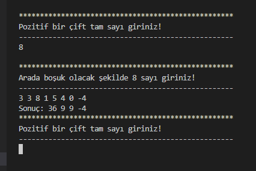

# Integer İkililerin Toplamı
Bu uygulama kullanıcıdan sayıları karşılaştırarak toplayan bir **Konsol Uygulama**'dır. **PatikaAcademy.dev** platformunun **Başlangıç Seviyesi .Net Core Patikası** eğitimi kapsamında **C# Projeleri** dersi için yapılmıştır.

| İçerik |
| :-: |
| .gitignore |
| README.md |
| LICENSE |
| Console Applicetion |

## Çalışma Mantığı
Öncelikle kullanıcıdan karşılaştırılacak sayıların adet bilgisi alınır. Sayılar ikişerli gruplar halinde karşılaştırılır. Bu yüzden adet sayısı bir çift sayı olmalıdır. Aksi takdirde bir sayı tek başına kalır ve başka bir sayı ile karşılaştırılamaz.

**Örn:**
```
A = {1, 3, 4, 5, 2}    => (1 - 3), (4 - 5), (2 - ?)
B = {6, 3, 9, 9, 1, 3} => (6 - 3), (9 - 9), (1 - 3)
```

İki sayı karşılaştırıldığında sayılar birbirinden farklı ise iki sayı toplanır (sayı 1 + sayı 2), aynı ise toplamın karesi alınır ((sayı 1 + sayı 2)^2). Ardından sonuç kullanıcıya sunulur.



## Kurulum
Öncelikle projeyi klonlayın.

```
git clone https://github.com/vahdetsavci/integer_ikililerin_toplami.git
```

## Kullanım
Projeyi klonladıktan sonra **Visual Studio Code** üzerinde açınız.

```
code integer_ikililerin_toplami
```

## LİSANS
[MIT](LICENSE)
